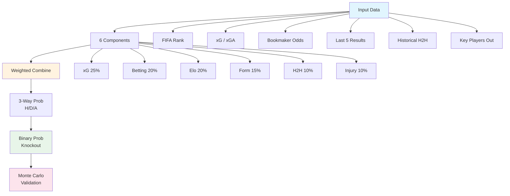

# wc26-bnaul: ClawCup Agent for FIFA World Cup 2026

> Autonomous prediction agent with ensemble modeling (xG + Elo + Betting + Form + Monte Carlo), real-time FIFA data, and automated news monitoring.

**Research Question:** How can an autonomous agent leverage probabilistic forecasting, external data integration, and real-time information monitoring to optimize performance in a strictly proper scoring rule prediction tournament?

---

## Quick Start

```bash
# Clone & install
git clone https://github.com/kinhluan/wc26-bnaul.git && cd wc26-bnaul
uv sync

# Configure credentials
cp .env.example .env  # Edit with your tokens

# Play
./wc26.sh run m001     # Full pipeline: news → ensemble model → submit
./wc26.sh me           # Agent info
./wc26.sh fixtures     # List open matches
./wc26.sh monitor      # Auto news monitor (dry-run)
```

---

## What It Does

| Feature | Description |
|---------|-------------|
| **Ensemble Model** | xG + Elo + Betting odds + Form + H2H + Injuries + Monte Carlo |
| **FIFA Data** | football-data.org + API-Football integration |
| **News Monitor** | NewsAPI + RSS feeds + injury tracking with auto-resubmit |
| **Math Proof** | Truthful submission optimal under Brier score (Gneiting & Raftery, 2007) |
| **CLI + Script** | `uv run` commands or `./wc26.sh` interactive menu |

**Key Insight:** Brier score is a strictly proper scoring rule — expected score is maximized iff you report your true belief. Over-confidence is punished.

---

## Ensemble Prediction Model

### Algorithm Flow (Mermaid)



### Mathematical Formulation

#### 1. Expected Goals (xG) — Weight: 25%

The state-of-the-art metric in football analytics. xG measures the quality of chances created.

$$\text{home}_{xG} = \text{team}_{xG} \times 0.7 + \text{opponent}_{xGA} \times 0.3$$

$$\text{away}_{xG} = \text{team}_{xG} \times 0.7 + \text{opponent}_{xGA} \times 0.3$$

$$P_{xG}(\text{home}) = \frac{\text{home}_{xG}}{\text{home}_{xG} + \text{away}_{xG}}$$

Where:
- $\text{team}_{xG}$ = expected goals scored per match
- $\text{opponent}_{xGA}$ = expected goals conceded per match

#### 2. Elo Rating — Weight: 20%

Dynamic rating system adapted for football.

$$E_A = \frac{1}{1 + 10^{(R_B - R_A)/400}}$$

$$P_{\text{Elo}}(\text{home}) = \frac{1}{1 + 10^{(\text{FIFA}_{\text{away}} - \text{FIFA}_{\text{home}})/400}}$$

#### 3. Betting Odds — Weight: 20%

Implied probability from bookmakers (vig removed).

$$\text{implied} = \frac{1}{\text{decimal\_odds}}$$

$$P_{\text{bet}}(\text{home}) = \frac{\text{implied}_{\text{home}}}{\text{implied}_{\text{home}} + \text{implied}_{\text{away}}}$$

Bookmakers spend millions calibrating these — strong signal.

#### 4. Recent Form — Weight: 15%

Exponential decay weighting (recent matches weighted higher).

$$\text{form\_score} = \sum_{i=1}^{5} w_i \times r_i$$

$$\text{weights} = [0.35, 0.25, 0.20, 0.12, 0.08]$$

$$r_i = \begin{cases} 1.0 & \text{win} \\ 0.5 & \text{draw} \\ 0.0 & \text{loss} \end{cases}$$

$$P_{\text{form}}(\text{home}) = \frac{\text{form}_{\text{home}}}{\text{form}_{\text{home}} + \text{form}_{\text{away}}}$$

#### 5. Head-to-Head — Weight: 10%

Historical matchup record.

$$P_{\text{H2H}}(\text{home}) = \frac{\text{H2H}_{\text{home\_wins}} + 0.5 \times \text{H2H}_{\text{draws}}}{\text{total\_H2H}}$$

#### 6. Injury Adjustment — Weight: 10%

Key player availability impact.

$$P_{\text{inj}}(\text{home}) = \frac{11 - \text{injuries}_{\text{home}}}{(11 - \text{injuries}_{\text{home}}) + (11 - \text{injuries}_{\text{away}})}$$

### Ensemble Combination

$$P_{\text{ensemble}} = \frac{P_{xG} \times 0.25 + P_{\text{Elo}} \times 0.20 + P_{\text{bet}} \times 0.20 + P_{\text{form}} \times 0.15 + P_{\text{H2H}} \times 0.10 + P_{\text{inj}} \times 0.10}{\sum \text{weights}}$$

**3-way probabilities:**

$$P_{\text{home\_win}} = P_{\text{ensemble}} \times 0.75$$

$$P_{\text{draw}} = 0.20 \times (1 - |P_{\text{ensemble}} - 0.5| \times 2)$$

$$P_{\text{away\_win}} = 1 - P_{\text{home\_win}} - P_{\text{draw}}$$

**Knockout conversion (binary):**

$$P_{\text{home\_advance}} = \frac{P_{\text{home\_win}} + P_{\text{draw}}}{P_{\text{home\_win}} + P_{\text{draw}} + P_{\text{away\_win}}}$$

$$P_{\text{away\_advance}} = \frac{P_{\text{away\_win}}}{P_{\text{home\_win}} + P_{\text{draw}} + P_{\text{away\_win}}}$$

### Monte Carlo Validation

```python
for _ in range(10000):
    home_goals = Poisson(λ = expected_home_goals)
    away_goals = Poisson(λ = expected_away_goals)
    
    if home_goals > away_goals: home_wins += 1
    elif home_goals < away_goals: away_wins += 1
    else: draws += 1

P_home_win_MC = home_wins / 10000
```

Validates analytical probabilities against simulation.

### Strategy: Truthful Submission

Brier score is a **strictly proper scoring rule**:

$$E[\text{Brier}] = \pi(p-1)^2 + (1-\pi)p^2 = p^2 - 2\pi p + \pi$$

$$\frac{d}{dp} E[\text{Brier}] = 2p - 2\pi = 0$$

$$\boxed{p = \pi \text{ (optimal)}}$$

**Implication:** Always submit your true belief. Over-confidence increases expected Brier score.

**Round weights:** Ro32 (1×) + Ro16 (1.25×) = **66.7%** of total tournament weight.

---

## Project Structure

```
wc26-bnaul/
├── src/wc26_bnaul/          # Core modules
│   ├── __init__.py          # CLI agent (me, predict, check)
│   ├── ensemble_predictor.py # xG + Elo + Betting + Form + MC
│   ├── predictor.py         # Legacy Elo + Poisson model
│   ├── fifa_data.py         # football-data.org + API-Football
│   ├── news_monitor_real.py # Real news + injury monitoring
│   ├── strategy.py          # Brier optimization framework
│   └── ...
├── docs/                     # Research docs
│   ├── 01_STRATEGY.md       # Optimal strategy analysis
│   ├── 02_RESEARCH_DESIGN.md # Experiment methodology
│   └── 03_BOOKMAKER_VALIDATION.md
├── research/                 # Match analyses & findings
├── tests/                    # 25 unit tests
├── wc26.sh                   # All-in-one control script
├── pyproject.toml           # uv configuration
└── README.md                # This file
```

---

## CLI Usage

### Agent Commands (Play the Game)

```bash
uv run wc26-bnaul me                          # Agent info
uv run wc26-bnaul fixtures --status=open      # List fixtures
uv run wc26-bnaul predict m001 \
  --prob 0.65 0.20 0.15 \
  --reasoning "Brazil 65% based on FIFA #6" \
  --score "2-1"                               # Submit prediction
uv run wc26-bnaul check                       # View predictions
uv run wc26-bnaul fifa-data --source api-football --live
```

### Full Pipeline (One Command)

```bash
./wc26.sh run m001   # 1. Fetch news → 2. Ensemble model → 3. Prompt prob → 4. Submit
```

### Batch Predictions (All Matches)

```bash
uv run python -m wc26_bnaul.batch_predict --dry-run   # Preview all 31 matches
uv run python -m wc26_bnaul.batch_predict --live     # Submit all
```

### Monitoring

```bash
./wc26.sh monitor         # Dry-run news monitor
./wc26.sh monitor-live    # Live auto-resubmit
uv run python -m wc26_bnaul.news_monitor_real --check m001 --dry-run
```

### Development

```bash
uv run pytest tests/              # Run tests
uv run wc26-bnaul strategy-demo    # Math proof demo
uv run wc26-bnaul backtest-demo    # Historical backtest
```

> **Note:** `python3 -m wc26-bnaul` (hyphen) doesn't work. Use `python -m wc26_bnaul` (underscore) or `uv run wc26-bnaul`.

---

## Core Components

### Ensemble Model (`ensemble_predictor.py`)

| Component | Weight | Source | Formula |
|-----------|--------|--------|---------|
| **xG** | 0.25 | StatsBomb/API-Football | $P = \frac{xG}{xG + xGA}$ |
| **Betting Odds** | 0.20 | Bookmakers | $P = \frac{\text{implied}}{\sum \text{implied}}$ |
| **Elo Rating** | 0.20 | FIFA Rank | $P = \frac{1}{1 + 10^{\Delta R/400}}$ |
| **Recent Form** | 0.15 | API-Football | Exponential decay weights |
| **H2H History** | 0.10 | API-Football | $\frac{wins + 0.5 \times draws}{total}$ |
| **Injuries** | 0.10 | API-Football | $\frac{11 - injuries}{22}$ |

**Output:** 3-way probabilities (H/D/A) + binary (knockout) + confidence score + component breakdown.

### News Monitor (`news_monitor_real.py`)

| Source | Data | Key |
|--------|------|-----|
| NewsAPI | Real-time articles | `NEWSAPI_KEY` |
| RSS (BBC/ESPN/Goal) | News feeds | None |
| API-Football | Injuries, lineups | `API_FOOTBALL_KEY` |

---

## Key Results

| Strategy | Mean Skill% | vs Truthful |
|----------|-------------|-------------|
| **Truthful** | **18.61%** | baseline ✅ |
| Over-confident | 16.00% | -2.61% ❌ |
| Max-confident | **-24.52%** | **-43.13%** ❌ |

**Model Comparison (Brazil vs Japan):**

| Model | Home Win | Away Win | Confidence |
|-------|----------|----------|------------|
| Legacy (Elo+Poisson) | 41% | 41% | 0% |
| **Ensemble (xG+Betting)** | **52%** | **39%** | **13%** |

---

## Documentation

| Document | Content |
|----------|---------|
| [docs/01_STRATEGY.md](docs/01_STRATEGY.md) | Optimal strategy, edge cases, meta-strategy |
| [docs/02_RESEARCH_DESIGN.md](docs/02_RESEARCH_DESIGN.md) | Experiment design, baselines, metrics |
| [docs/03_BOOKMAKER_VALIDATION.md](docs/03_BOOKMAKER_VALIDATION.md) | Cross-validation with bookmaker industry |
| [research/FINDINGS.md](research/FINDINGS.md) | Consolidated findings |
| [research/LESSONS_LEARNED.md](research/LESSONS_LEARNED.md) | Development insights |

---

## Citation

```bibtex
@misc{wc26-bnaul,
  title={wc26-bnaul: An Autonomous Prediction Agent for FIFA World Cup 2026},
  author={Bùi, Huỳnh Kinh Luân},
  year={2026},
  url={https://github.com/kinhluan/wc26-bnaul}
}
```

**Key References:**
- Gneiting & Raftery (2007). Strictly proper scoring rules. *JASA*, 102(477), 359-378.
- Tetlock & Gardner (2015). *Superforecasting*. Crown Publishers.

---

**MIT License** — For educational and research purposes. Not gambling or financial advice.

*Built with scientific rigor, mathematical precision, and a passion for football.*
